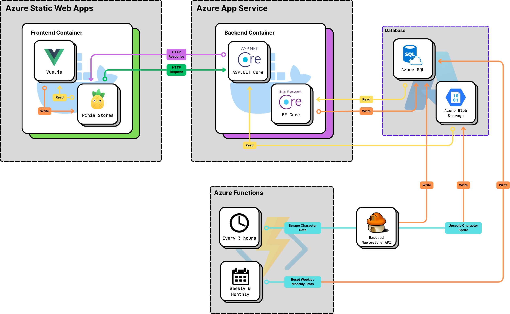

 

# MapleHotties

An end-to-end, full-stack web application where [MapleStory](https://www.nexon.com/maplestory/) players can vote on the hottest/nottest characters of the week.

<!-- [maplehotties.com](YOUR_DEPLOYED_URL_HERE) | [API Swagger Specification](./docs/API.md) | [Architecture](./docs/ARCHITECTURE.md) -->

<!-- # Screenshots

 -->

## Project Overview

MapleTinder is a web app where Maplestory players can vote on the outfits of other Maplestory characters, ranking them as hot, or not. Players can mark characters as favourites to save their outfits for later reference. On top of this, there is also a leaderboard where players can see how the community has rated everyone's outfits.

### Features

- **Character Voting System** - Browse and vote on MapleStory characters and their outfits with through a Tinder-inspired, swiping interface.
- **Weekly, Monthly, and All Time Leaderboards** - Real-time character outfit rankings that reset weekly and monthly.
- **Vote History** - Track your voting history and favorite characters.
<!-- - **Admin Dashboard** - Manage characters, moderate content, and view analytics -->

## Tech Stack

### Frontend
- Framework: **Vue 3**
- Application Logic: **Javascript** and **Typescript**
- State Management: **Pinia**
- Styling: **Tailwind CSS**
- UI Components: **Shadcn/vue**

### Backend
- Framework: **ASP.NET Core**
- Database: **Microsoft SQL Server**
- ORM: **Entity Framework Core**
- Authentication: **ASP.NET Identity**, **JWT**, **Discord** & **Google OAuth2**
- Testing: **NUnit**

<!-- ### DevOps
- Containerization: Docker & Docker Compose
- CI/CD: GitHub Actions -->

## Software Architecture

<!-- ## API Documentation

For detailed API documentation, check out the [Swagger Spec](./backend/docs/api.yaml).

### Quick Reference

| Method | Endpoint | Description |
|--------|----------|-------------|
| GET | `/api/characters` | Get all characters |
| GET | `/api/characters/:id` | Get character by ID |
| POST | `/api/votes` | Submit a vote |
| GET | `/api/leaderboard` | Get weekly rankings |
| POST | `/api/auth/register` | Register new user |
| POST | `/api/auth/login` | User login | -->

<!-- ## Design Decisions

### Voting Mechanism
The voting system uses a combination of session tracking and IP-based rate limiting to prevent manipulation while keeping the barrier to entry low for casual users.

### Weekly Reset
Leaderboards reset every Monday at midnight UTC, keeping the competition fresh and encouraging repeat engagement.

### Character Data
Character information is manually curated for quality control, with admin tools for easy updates and additions. -->

<!-- ## Future Plans

- [ ] User authentication system with profiles and vote history
- [ ] Social sharing features (share favorite characters)
- [ ] Character comparison tool
- [ ] Monthly/yearly leaderboards with archive
- [ ] Admin analytics dashboard with voting trends
- [ ] WebSocket integration for real-time leaderboard updates
- [ ] Mobile app version (React Native)
- [ ] Community character submissions with moderation -->

## Contact

Elieser Capillar - [GitHub](https://github.com/eliesercapillar) - [LinkedIn](https://www.linkedin.com/in/eliesercapillar/)

Project Link: [https://github.com/eliesercapillar/MapleTinder](https://github.com/eliesercapillar/MapleTinder)

## Acknowledgments

- MapleStory character designs and assets are property of Nexon
- I took heavy inspiration from Tinder's swipe interface

---

⭐️ *If you found this project interesting, please consider giving it a star!* ⭐️
